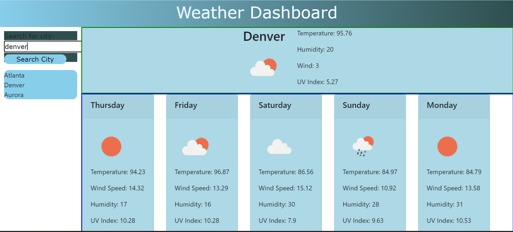

# What's the Weather?

## Description

With this handy app a user can check the weather in any city in the country of the US of A.  Icons will appear according to the stated weather, as well as a forecast for the coming days.  Easy peezey!

[See the app!](https://kalebritt.github.io/weather-api-hw6/)

## Table of Contents

- [What's the Weather?](#whats-the-weather)
  - [Description](#description)
  - [Table of Contents](#table-of-contents)
- [Usage](#usage)
- [Screenshot](#screenshot)
- [Technologies](#technologies)
- [Credits](#credits)
- [License](#license)
- [Installation](#installation)

# Usage

This Command-Line Interface (CLI) utilizes an Application Programming Interface (API) using Express.js and MYSQL database using Sequalize.

# Screenshot

Below is a screenshot of the deployed app.

# Technologies
-HTML  
-JavaScript  
-Bootstrap

# Credits

Tremendous credit to Jude C. and her infinite knowledge and experience she was generous enough to share with me.

# License

# Installation

'npm i' is a good place to start!

